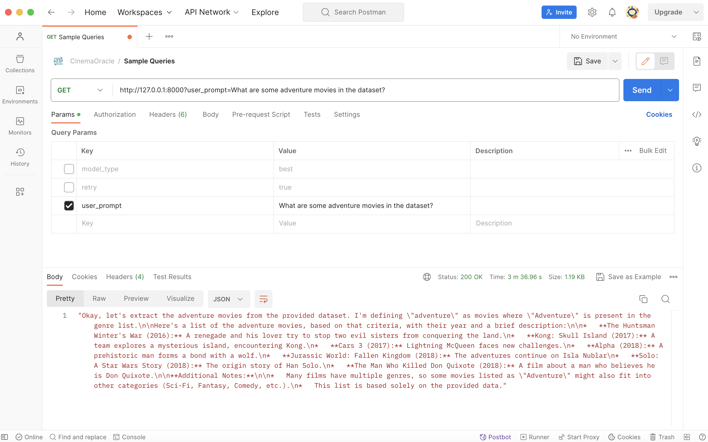
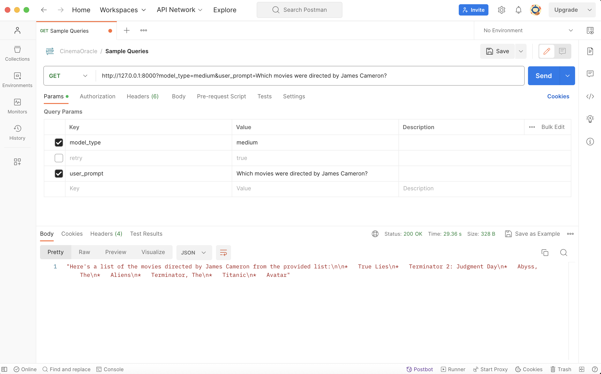
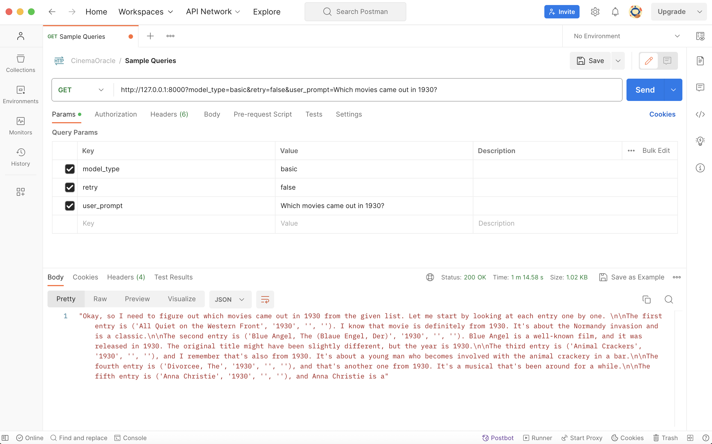

# Cinema Oracle

This project uses the [MovieLens dataset (small version: ~100k ratings, ~9k movies)](https://grouplens.org/datasets/movielens/) and the [TMDB 5000 Movie Dataset](https://www.kaggle.com/datasets/tmdb/tmdb-movie-metadata). The files from these datasets can be found in the `datasets` directory. 

### Structure:
- `requirements.txt` lists the Python libraries used. Note that this project uses Python 3.13.
- `etl.py` shows the script that was used to extract the data from 5 CSV files (3 from MovieLens, 2 from TMDB), transform that data into the desired tables and columns, and load them into a SQLite database. Now that the SQLite database has been created, this script does not need to be run again. 
- `sqlite:///database.db` is the SQLite database, which has 3 tables: movies, genres, and ratings
- `llm.py` provides the essential building blocks for calling any of 3 LLMs (see table below)
- `main.py` contains the logic for the FastAPI API. 

### Quickstart:

1. `git clone git@github.com:dpruden13/cinema-oracle.git`
2. `pip install -r requirements.txt`
3. Add your OpenAI API key to an environment variable called `OPENAI_API_KEY` to your `.env` (recommended) and/or download Ollama [here](https://ollama.com/download) and then download the model by selecting gemma3:12b in the Ollama GUI by asking a simple prompt such as "Who are you?"
4. `fastapi dev main.py`
5. Use Postman or another client to send requests (see screenshots below) to endpoints like so: [http://127.0.0.1:8000?user_prompt=What are some adventure movies in the dataset?](http://127.0.0.1:8000?user_prompt=What are some adventure movies in the dataset?)

### Testing:

### LLMs:

| Model                                                                                             | Via                      | Usage                 | Pros                                                        | Cons                                                                                                                                                                                         |
|---------------------------------------------------------------------------------------------------|--------------------------|-----------------------|-------------------------------------------------------------|----------------------------------------------------------------------------------------------------------------------------------------------------------------------------------------------|
| [DeepSeek-R1-Distill-Qwen-1.5B](https://huggingface.co/deepseek-ai/DeepSeek-R1-Distill-Qwen-1.5B) | HuggingFace Transformers | `model_type='basic'`  | No setup and it's free                                      | Slow (initial response time can be 5 mins) and it can return rambling, cut-off responses that don't clearly answer the prompt and can contain outlandish claims                              |
| [gemma3:12b](https://ollama.com/library/gemma3:12b)                                               | Ollama                   | `model_type='medium'` | Somewhat fast (response time within 1 minute) and it's free | Requires setup (download Ollama [here](https://ollama.com/download) and then download the model by selecting `gemma3:12b` in the Ollama GUI by asking a simple prompt such as "Who are you?" |
| [gpt-4.1-nano](https://platform.openai.com/docs/models/gpt-4.1-nano)                                                                                  | OpenAI                   | `model_type='best'`   | Fast (response time in seconds) with high quality responses | Paid (see [here](https://platform.openai.com/docs/pricing) for pricing details) and requires an OpenAI API key with the environment variable `OPENAI_API_KEY`                                |

### Considerations:
- **Data Coverage:** IMDB or TMDB API
- **Prompt Engineering:** system_prompt vs. user_prompt
- **Context Engineering:** RAG
- **Hosting an Agent:** MCP Server
- **Security:** SQL Injection, Prompt Injection
