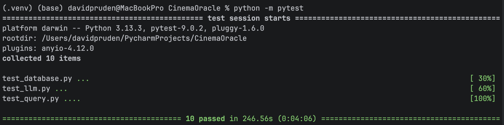

# Cinema Oracle

This API allows a user to query the [MovieLens dataset (small version: ~100k ratings, ~9k movies)](https://grouplens.org/datasets/movielens/) and the [TMDB 5000 Movie Dataset](https://www.kaggle.com/datasets/tmdb/tmdb-movie-metadata) using natural language via several available LLMs.  

### Quickstart:

1. `git clone git@github.com:dpruden13/cinema-oracle.git`
2. `pip install -r requirements.txt`
3. Add your OpenAI API key to an environment variable called `OPENAI_API_KEY` to your `.env` (recommended) and/or download Ollama [here](https://ollama.com/download) and then download the model by selecting `gemma3:12b` in the Ollama GUI by asking a simple prompt such as "Who are you?"
4. `fastapi dev main.py`
5. Use Postman or another client to send GET requests (see screenshots below) to http://127.0.0.1:8000 with the required query parameter `user_prompt` 

##### Sample GET Request about Movie Genre with the Best Model

##### Sample GET Request about Movie Director with the Medium Model

##### Sample GET Request about Movie Year with the Basic Model

### Structure:
- `datasets` is the directory holding the files for the MovieLens and TMDB datasets.
- `requirements.txt` lists the Python libraries used. Note that this project uses Python 3.13.
- `etl.py` shows the script that was used to extract the data from 5 CSV files (3 from MovieLens, 2 from TMDB), transform that data into the desired tables and columns, and load them into a SQLite database. Now that the SQLite database has been created, this script does not need to be run again. 
- `sqlite:///database.db` is the SQLite database, which has 3 tables: `movies`, `genres`, and `ratings`. Note that, in the `movies` table, the `cast` column had to be renamed `actors` because `cast` was causing errors in SQL queries.
- `database.py` offers a helper function for querying the SQLite database.
- `llm.py` provides the essential building blocks for calling any of 3 LLMs (see table below).
- `query.py` has the main callable in this API (`answer_query()`) and related logic for intent detection for user prompts.
- `main.py` contains the logic for the FastAPI API. To keep things simple for this proof of concept, for now it's a straightforward GET endpoint with 3 query parameters: `user_prompt` (required), `model_type` (optional, defaults to `'best'`), and `retry` (optional, defaults to `True`). When `True`, `retry` takes a "cascading" approach in which, if a particular LLM fails for any reason, it retries the user prompt on a "lesser" model (OpenAI -> gemma -> DeepSeek). 
- `test_database.py`, `test_llm.py`, and `test_query.py` are the tests called via `pytest` (see the Testing section below).

### LLMs:

| Model                                                                                             | Via                      | Usage                 | Pros                                                                                                  | Cons                                                                                                                                                                                         |
|---------------------------------------------------------------------------------------------------|--------------------------|-----------------------|-------------------------------------------------------------------------------------------------------|----------------------------------------------------------------------------------------------------------------------------------------------------------------------------------------------|
| [DeepSeek-R1-Distill-Qwen-1.5B](https://huggingface.co/deepseek-ai/DeepSeek-R1-Distill-Qwen-1.5B) | HuggingFace Transformers | `model_type='basic'`  | No setup and it's free                                                                                | Slow (initial response time can be 5 minutes) and it can return rambling, cut-off responses that don't clearly answer the prompt and can contain outlandish claims                           |
| [gemma3:12b](https://ollama.com/library/gemma3:12b)                                               | Ollama                   | `model_type='medium'` | Somewhat fast (response time within 1 minute) and it's free                                           | Requires setup (download Ollama [here](https://ollama.com/download) and then download the model by selecting `gemma3:12b` in the Ollama GUI by asking a simple prompt such as "Who are you?" |
| [gpt-4.1-nano](https://platform.openai.com/docs/models/gpt-4.1-nano) (Recommended & Default)      | OpenAI                   | `model_type='best'`   | Fast (response time in seconds depending on how much SQL data is fetched) with high-quality responses | Paid (see [here](https://platform.openai.com/docs/pricing) for pricing details) and requires an OpenAI API key with the environment variable `OPENAI_API_KEY`                                |

### Testing:

`python -m pytest`

##### Example of All Tests Passing

Note that running all the tests can take several minutes as some of them are calling LLMs. Also note that, due to the nondeterministic nature of LLMs, some of the tests might sometimes fail due to unpredictable outputs.

### Considerations:
- **UI/UX:** Depending on the user prompt and how much data it fetches from the SQLite database, the response time can take up to about a minute even with the `best` model. Adding a Streaming response could improve UX.
- **Data Coverage:** Because the MovieLens dataset has ~9k movies and the TMDB dataset has ~5k movies, the former is used as the main list of movies with extra fields (such as `overview`, `actors`, and `director`) supplemented by the latter as available. The [IMDb API](https://developer.imdb.com/documentation/api-documentation/getting-access/) or [TMDB API](https://developer.themoviedb.org/docs/getting-started) could be used to fill in the missing gaps. 
- **Prompt Engineering:** LLM responses could likely be improved by splitting up prompts between the system_prompt and user_prompt instead of using only the latter.
- **Context Engineering:** To speed up response times and allow more ambitious user prompts accessing more data, Retrieval-Augmented Generation (RAG) could be implemented with a vector database such as Pinecone. 
- **Hosting an Agent:** To make this API available to AI agents, a Model Context Protocol (MCP) server could be set up and hosted.
- **Security:** The data in the MovieLens and TMDB datasets is not sensitive in nature. That said, to become production ready, more coding would need to be done to guard against SQL Injection and Prompt Injection.
